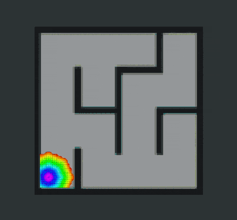
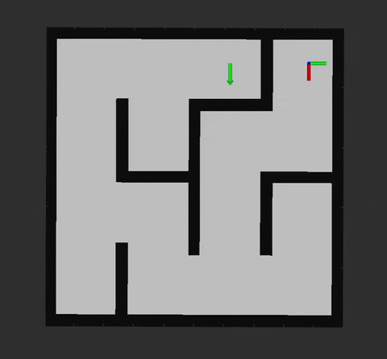
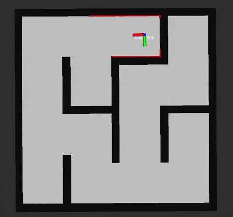

# Wavefront Planner
This repository provides the `wavefront_planner` ROS package, which creates a planned path for a mobile robot on the basis of an occupancy grid map. The planner finds a minimum cost plan from a start position to an end position. The package assumes a circular robot for applying the safe distance to the obstacles.

This is a research code, expect that it changes often and any fitness for a particular purpose is disclaimed.
## Overview
The wavefront expansion algorithm is a specialized [potential field](https://en.wikipedia.org/wiki/Motion_planning#Artificial_potential_fields) path planner with breadth-first search ([BFS](https://en.wikipedia.org/wiki/Breadth-first_search)) to avoid local minima. It uses a growing circle from the goal to the robot. The nearest neighbors are analyzed first and then the radius of the circle is extended to distant regions.

Wave Propagation | Cost Map | Navigation
:---: | :---: | :---:
 |  |  |

## Installation
**Dependencies:** This software is built on the Robotic Operating System ([ROS](https://www.ros.org/)). We assume that the followings are installed.
- Ubuntu (Tested on 20.04) 
- ROS (Tested on [ROS Noetic](https://wiki.ros.org/noetic))
- [Eigen](https://eigen.tuxfamily.org/index.php?title=Main_Page) (C++ template library for matrix operation)
- [grid_map](https://github.com/ANYbotics/grid_map) library

For installation of **`grid_map`**, use the following commands:
```
sudo apt install ros-noetic-grid-map
```

**Build:** In order to install the `wavefront_planner` package, clone the latest version from this repository and compile the package.
  ```
  cd ~/{your-ros-workspace}/src
  git clone https://github.com/Ikhyeon-Cho/wavefront_planner.git
  cd ..
  catkin build wavefront_planner
  ```
**Note:** For the best performance, complie with the option `-DCMAKE_BUILD_TYPE=release`. It makes significant improvements.

## Basic Usage
1. Configure the parameters in `wavefront_planner_ros/config/params.yaml`
2. Run the launch file:
  ```
  roslaunch wavefront_planner run.launch
  ```


> **Note:** Thanks to the use of Eigen, the planner is sufficiently fast enough for practical usage. The figure above is just a vislualization of a search process. (Typically finds the path within microseconds in indoor environments, and few miliseconds in large-scale outdoor environments)

## Nodes
### wavefront_planner
#### Subscribed Topics
- **`/map`** ([nav_msgs/OccupancyGrid](https://docs.ros.org/en/noetic/api/nav_msgs/html/msg/OccupancyGrid.html)) <br>
The map for planning.

- **`/move_base_simple/goal`** ([geometry_msgs/PoseStamped](https://docs.ros.org/en/noetic/api/geometry_msgs/html/msg/PoseStamped.html)) <br>
The pose of navigation goal. When the goal message is not in the map frame, it is internally transformed to the map frame. 

- **`/tf`** ([tf2_msgs/TFMessage](https://docs.ros.org/en/jade/api/tf2_msgs/html/msg/TFMessage.html)) <br>
Transforms from tf tree. The current pose of the robot is obtained by using tf transforms

#### Published Topics
- **`/wavefront_planner/path`** ([nav_msgs/Path](https://docs.ros.org/en/noetic/api/nav_msgs/html/msg/Path.html)) <br>
The computed path, published every time during navigation. See `~pathPublishRate` parameters to specify the publish rate.

- **`/wavefront_planner/debug/costmap`** ([grid_map_msgs/GridMap](https://docs.ros.org/en/kinetic/api/grid_map_msgs/html/msg/GridMap.html)) <br>
For debug purpose. Visualize the costmap.

- **`/wavefront_planner/debug/costmap`** ([nav_msgs/OccupancyGrid](https://docs.ros.org/en/noetic/api/nav_msgs/html/msg/OccupancyGrid.html)) <br>
For debug purpose. Visualize the occupancy map that the planner perceives.


#### Parameters
- **`~baselinkFrame`** (string, default: base_link) <br>
    The frame id of the robot. Inside the code, transform to this parameters will be used for robot pose calculation.

- **`~mapFrame`** (string, default: map) <br>
    The frame id of the map. Inside the code, transform to this parameters will be used for robot pose calculation.

- **`~pathPublishRate`** (double, default: 20.0) <br>
    The publish rate of the path [Hz].

- **`~propagateUnknownCell`** (bool, default: false) <br>
    If set true, then the wave propagation will search the unknown state regions.

- **`~inflationRadius`** (double, default: 0.5 ) <br>
    The inflation range [m]. Consider the robot size and set the value accordingly.

- **`~debugMode`** (bool, default: false) <br>
    If set true, the node will publish the costmap and the received occupancy map.

## Citation
If you find this project useful, please cite our paper:

```bibtex
@article{lee2022odsbot,
  title={ODS-Bot: Mobile robot navigation for outdoor delivery services}, 
  author={Jinwon Lee, Geonhyeok Park, Ikhyeon Cho, Keundong Kang, Daehyun Pyo, Soohyun Cho, Minwoo Cho, and Woojin Chung},
  journal={IEEE Access}, 
  year={2022},
  volume={10},
  pages={107250-107258},
  doi={10.1109/ACCESS.2022.3212768}
}
```